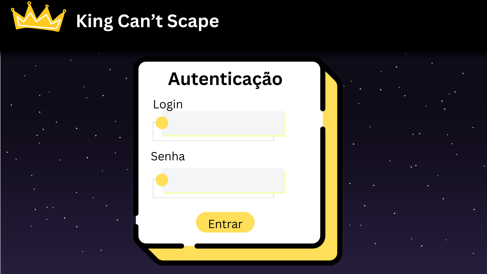

# KingCantScape

## Descrição
  Um site sobre um jogo que terá um botão de download para baixá-lo direto do navegador. No site também terá um login de usuário, sem estar logado o site não permitirá que baixe o jogo. Terá uma área de feedbacks para que os players deixem suas impressões.
  No jogo o objetivo será subir no castelo para poder escapar, mas ainda terá inimigos que tentarão impedir você de fazer isso.

## Funcionalidades
  Um CRUD para os usuários cirarem conta e logarem para poder baixar o jogo;
  Um CRUD de feedback para os usuários escreverem suas impressões do jogo;

## Requisitos
  ## Tecnologias Utilizadas:
  - PHP;
  - HTML;
  - CSS;
  - MySQL;
  - GML;

Árvore de arquivos :
```
├── KingCantScape
|   |
|   ├── db
│   |   ├ dump.sql
│   |
|   ├── style
│   |   ├ style.css
|   |
|   ├ index.php
|   ├ login.php
|   ├ logout.php
|   |
│   ├── usuarios
│   │   ├ create.php
│   │   ├ read.php
│   │   ├ update.php
│   │   ├ delete.php
|   |
│   ├── tbFeedback
│   │   ├ create.php
│   │   ├ read.php
│   │   ├ update.php
│   │   ├ delete.php

```
## Protótipos do site
- Página inicial


- Página de autenticação


- Págiina de criar um usuário

